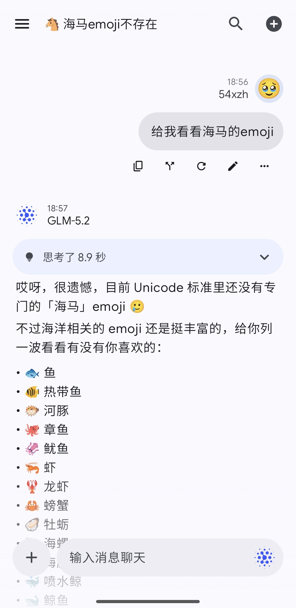
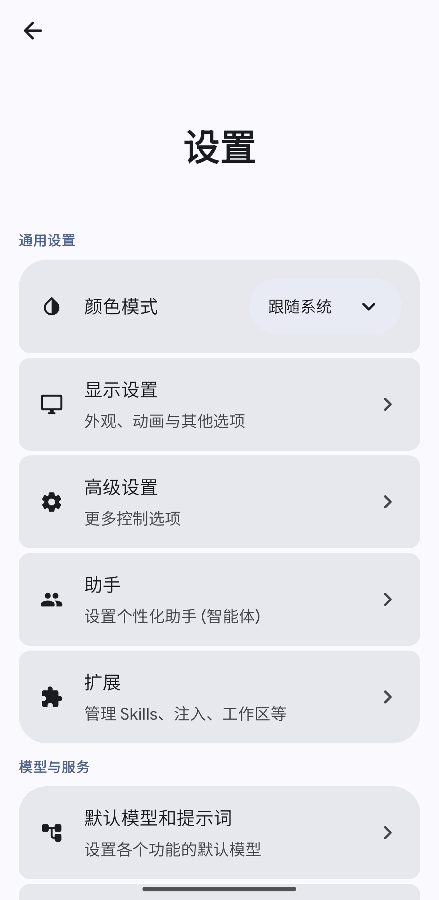

# FLIT

  

**FLIT** 是一款功能丰富的 Android LLM 客户端。它是 [RikkaHub](https://github.com/re-ovo/RikkaHub) 的分支 [LastChat](https://github.com/Cocolalilal/LastChat) 的分支版本，在原有的基础上增加了一些特色功能。

本项目旨在为 Android 平台提供一个注重隐私且高度个性化的 AI 聊天体验。

## 图集

  
    &nbsp;&nbsp;&nbsp;&nbsp;
  

## ✨ 核心特性

### 先进的 AI 能力
*   **多服务商支持**: 原生支持 **OpenAI**、**Google** 和 **OpenRouter**，同时也支持自定义服务商。配合**多 Key 轮换**提升可用性。
*   **多档位推理 & 能力同步**: 提供 Standard 到 **极高 (XHigh)** 多档推理强度；模型能力数据库可从远端自动同步，免去手动配置模态/能力的麻烦。
*   **本地 RAG 记忆**: 基于**向量嵌入**的长期记忆系统，助手能“记住”过去对话的细节；支持**手动编辑记忆**，并可在对话中让模型**主动检索记忆或历史聊天记录**。
*   **多模态输入**: 支持通过文字、图片、视频和音频交互；超出上下文轮次的历史图片会自动 **OCR 转文本归档**，避免信息丢失。
*   **Agent Skills**: 兼容大部分现有 Skills，支持**手动指定注入**哪些技能，并可在沙盒工作区中使用配套文件与脚本。

### 工具与集成
*   **本地设备控制**: AI 可以根据你的需要与设备交互：
    *   发送通知、启动应用、读取通知
    *   设置闹钟/提醒，并能**主动创建、编辑、删除定时任务**
    *   主动获取当前时间
*   **代码执行**: 内置 **JavaScript 引擎** (QuickJS) 与 **Python 引擎**，文件读写与脚本执行统一走**审批卡片**确认，安全可控。
*   **网络搜索**: 集成多个搜索服务，支持**同时启用多源**、**顺序回退**策略；搜索可选**子代理模式**，节省上下文。

### 助手管理
*   **多助手**: 创建、管理并无限制切换自定义助手。
*   **标签系统**: 使用自定义标签组织助手。
*   **导入/导出**: 轻松分享或备份助手配置，导出备份兼容 Rikkahub。

### 现代且流畅的 UI
*   **Material You**: 全面采用 Material Design 3，支持随壁纸改变的**动态色彩**，配合**顶栏模糊**让界面更有层次。
*   **丰富渲染**: 支持 LaTeX 数学公式、代码高亮、表格的 Markdown 渲染，**Mermaid 图表可导出为图片**。
*   **细节交互**: 长按消息直接选文本、工具栏常驻显示；**遮罩调色盘**支持 HEX 输入与 HSV 明度滑块；流式生成时向上滚动不再被强行闪回底部。

### 附加模块
*   **图像生成**: 专用于使用支持模型生成图像的界面。
*   **翻译器**: 专门的文本翻译模式。
*   **文本转语音 (TTS)**: 支持系统 TTS 及 OpenAI、Gemini、ElevenLabs、MiniMax、MiMo 等多家服务商。
*   **WebUI**: 提供网页端访问，配合**快捷磁贴**一键开关，方便在桌面浏览器继续对话。

### 隐私与数据
*   **本地优先**: 聊天记录和向量记忆均本地存储在你的设备上。
*   **多端备份**: 支持 **WebDAV** 与**对象存储**（如 R2 等）同步备份，并可开启**自动备份**。

## 技术栈
*   **Kotlin** & **Jetpack Compose**
*   **Koin** 依赖注入
*   **Room** & **DataStore** 持久化
*   **WorkManager** & **AlarmManager** 可靠的后台任务

## 致谢
*   原项目: [RikkaHub](https://github.com/re-ovo/RikkaHub),[LastChat](https://github.com/Cocolalilal/LastChat) 
*   关于页面灵感来自 [PixelPlayer](https://github.com/theovilardo/PixelPlayer)
*   图片裁剪工具修改自 [LavenderPhotos](https://github.com/kaii-lb/LavenderPhotos) 的图像编辑器
*   由 **AI Agent** 驱动开发

## 反馈与交流
欢迎加入反馈交流群:`1084874256`

## Star History

<a href="https://www.star-history.com/?repos=54xzh%2FFLIT&type=date&legend=top-left">
 <picture>
   <source media="(prefers-color-scheme: dark)" srcset="https://api.star-history.com/chart?repos=54xzh/FLIT&type=date&theme=dark&legend=top-left&sealed_token=N6CkRkLiryzntasoEmSDfxysejkr41rOeRsgeLyXAgn5EmI4rYdxis2ry_89ENzOMGP7J0JAXGOj3m_Fq7Vk5a5344zByO7tHro-C5r7bHJpYsy7A7iJIZwVDAuuUKunMcCbkvw-v2fwhyaa2P4VH8xEOe0lvwResgI6T4q4elpPcGYIjVAiEynkrCPW" />
   <source media="(prefers-color-scheme: light)" srcset="https://api.star-history.com/chart?repos=54xzh/FLIT&type=date&legend=top-left&sealed_token=N6CkRkLiryzntasoEmSDfxysejkr41rOeRsgeLyXAgn5EmI4rYdxis2ry_89ENzOMGP7J0JAXGOj3m_Fq7Vk5a5344zByO7tHro-C5r7bHJpYsy7A7iJIZwVDAuuUKunMcCbkvw-v2fwhyaa2P4VH8xEOe0lvwResgI6T4q4elpPcGYIjVAiEynkrCPW" />
   
 </picture>
</a>
